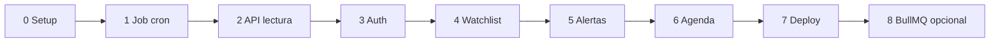

# Crypto Tracker API — Índice y convenciones globales

> Documento base. Todo lo que está acá aplica a **todas** las etapas; cada archivo de etapa lo da por incorporado y solo agrega lo propio.
> Versiones de librerías relevadas en npm el 2026-09-16.

## 1. Qué es el proyecto

Backend sin frontend (solo API + procesos en segundo plano) que:

1. Cada cierto intervalo consulta precios de criptomonedas en CoinGecko y los guarda como histórico en MongoDB (**job programado**).
2. Expone una API REST para consultar monedas, histórico y estadísticas.
3. Permite a usuarios autenticados (Firebase Auth) armar una watchlist y definir alertas de precio que se notifican por email.
4. Se despliega en Render, con la API y el worker como servicios separados.

El objetivo del proyecto es **aprender backend**, con foco en jobs, scheduling y workers. Por eso algunas decisiones priorizan entender el mecanismo por sobre la solución más corta.

## 2. Etapas

| Archivo | Etapa | Depende de |
| --- | --- | --- |
| `01-etapa-0-setup-base.md` | Setup base: Express, Mongo, config, errores, health | — |
| `02-etapa-1-primer-job.md` | Worker + node-cron + snapshots de precios | 0 |
| `03-etapa-2-api-rest.md` | API de lectura: monedas, histórico, estadísticas | 1 |
| `04-etapa-3-auth-firebase.md` | Usuarios y autenticación con Firebase Auth | 2 |
| `05-etapa-4-watchlists.md` | Watchlist por usuario | 3 |
| `06-etapa-5-alertas-email.md` | Alertas, outbox de notificaciones y email | 4 |
| `07-etapa-6-agenda.md` | Reemplazo de node-cron por Agenda (jobs persistidos) | 5 |
| `08-etapa-7-deploy-render.md` | Deploy en Render | 6 (puede adelantarse desde la 2) |
| `09-etapa-8-bullmq-redis.md` | Opcional: colas con BullMQ + Redis | 7 |



La etapa 7 (deploy) puede hacerse antes, apenas termina la 2, y repetirse después de cada etapa. Desplegar temprano y seguido es una práctica recomendada.

## 3. Decisiones tomadas

| Tema | Decisión | Motivo |
| --- | --- | --- |
| Runtime | Node.js 24 LTS | `firebase-admin` 14 pide Node ≥ 22 y `vitest` 5 pide 22.12+ o 24. |
| Lenguaje | TypeScript en modo `strict` | Consistente con tu ruta de aprendizaje MEAN. |
| Módulos | ESM (`"type": "module"`) | Agenda 6 es ESM-only; mejor arrancar así desde el día uno. |
| Framework HTTP | Express 5.2.x | Express 5 pasa automáticamente al manejador de errores las promesas rechazadas en handlers `async`. |
| Base de datos | MongoDB 8 (local en Docker, Atlas en producción) + Mongoose 9.x | — |
| Validación | Zod 4.x | Se valida todo lo que entra: body, query, params, variables de entorno y **respuestas de APIs externas**. |
| Logging | pino 10.x (JSON) | Logs estructurados, legibles por plataformas como Render. |
| Autenticación | Firebase Auth (el backend solo verifica ID tokens con `firebase-admin` 14.x) | Decisión tuya. |
| Proveedor de precios | CoinGecko, plan Demo (gratis, con API key) | 100 llamadas/min y **10.000 llamadas/mes**. |
| Moneda de cotización | Solo USD | Simplifica modelo y agregaciones. Multi-moneda queda fuera de alcance. |
| Intervalo de polling por defecto | Cada 10 minutos | Cada 10 min ≈ 4.464 llamadas en un mes de 31 días. Cada 5 min ≈ 8.928, demasiado cerca del tope de 10.000 si sumás seeds y ejecuciones manuales. |
| Tests | Vitest 5 + supertest 7 + mongodb-memory-server 11, **requeridos en cada etapa** | Decisión tuya. |
| Email | Nodemailer 10 vía SMTP | Mailpit en local, proveedor SMTP en producción. |
| Scheduler | node-cron 4 (etapas 1–5) → Agenda 6 (etapa 6) → BullMQ 6 opcional (etapa 8) | Progresión didáctica. |

## 4. Estructura de carpetas

```
src/
  app.ts                 # crea y configura la app Express (sin listen) — la usan los tests
  server.ts              # entrypoint del proceso API (listen + shutdown)
  worker.ts              # entrypoint del proceso worker (scheduler + shutdown)
  config/
    env.ts               # lectura y validación de variables de entorno
  db/
    connect.ts           # conexión y desconexión de Mongo
  lib/
    errors.ts            # clases de error de la app (AppError y derivadas)
    logger.ts
    clock.ts             # abstracción de "ahora" para poder testear tiempos
  middlewares/
  integrations/
    coingecko/           # cliente HTTP de CoinGecko
    firebase/            # verificación de tokens
    mailer/              # envío de emails
  modules/
    <dominio>/           # coins, snapshots, users, watchlist, alerts, notifications, job-runs
      <dominio>.model.ts
      <dominio>.schemas.ts      # esquemas Zod de entrada/salida
      <dominio>.service.ts      # lógica de negocio
      <dominio>.controller.ts   # traduce HTTP <-> service
      <dominio>.routes.ts
  jobs/                  # lógica de cada job, sin saber quién la dispara
  scripts/               # seeds y utilidades de línea de comandos
tests/
  unit/
  integration/
  helpers/
```

**Por qué capas (routes → controller → service → model):** el controller solo sabe de HTTP (leer params, devolver status). El service tiene la lógica y no sabe nada de HTTP, así que se puede testear y reutilizar desde un job. El model solo sabe de datos. Cuando un job necesita la misma lógica que un endpoint, llama al service, no al endpoint.

**Inyección de dependencias:** los services y jobs reciben sus dependencias (cliente de CoinGecko, mailer, reloj, logger) por parámetro en lugar de importarlas directamente. Eso permite reemplazarlas por versiones falsas en los tests. No hace falta una librería de DI: alcanza con funciones fábrica (`createPollPricesJob({ coingecko, clock, logger })`).

**Interfaces y constantes locales:** por defecto, cada interface o const vive colocada arriba del código que la usa, en el mismo archivo. Recién cuando 2 o más archivos de una misma carpeta empiezan a acumular interfaces o constantes abstraíbles (contenido realmente compartido entre ellos), se crea un único archivo compartido para esa carpeta —por ejemplo `middlewares/shared.ts` o `lib/shared.ts`—, organizado internamente con comentarios que separen secciones (tipos, constantes...) en vez de fragmentarse en un archivo por cada uno. Esta regla es general para cualquier carpeta de `src/`; los módulos de dominio (`modules/<dominio>/`) siguen su propia convención con `<dominio>.schemas.ts`.

## 5. Convenciones de API

### 5.1 Rutas
- Prefijo: `/api/v1`. Recursos en plural y kebab-case (`/api/v1/job-runs`).
- Rutas del usuario autenticado bajo `/api/v1/me/...`.
- Rutas de administración bajo `/api/v1/admin/...`.
- Rutas máquina a máquina bajo `/api/v1/internal/...` (etapa 7).
- Los health checks quedan fuera del prefijo: `/health`, `/health/ready`.

### 5.2 Formato de error (único para toda la API)

```json
{
  "error": {
    "code": "VALIDATION_ERROR",
    "message": "Descripción legible",
    "details": [{ "path": "query.limit", "message": "Debe ser <= 100" }],
    "requestId": "b3f1..."
  }
}
```

| code | HTTP | Cuándo |
| --- | --- | --- |
| `VALIDATION_ERROR` | 400 | Body, query o params inválidos |
| `UNAUTHENTICATED` | 401 | Falta el token o es inválido |
| `TOKEN_EXPIRED` | 401 | Token vencido |
| `FORBIDDEN` | 403 | Autenticado pero sin permiso |
| `NOT_FOUND` | 404 | Recurso o ruta inexistente |
| `CONFLICT` | 409 | Duplicado (por ejemplo, moneda ya en la watchlist) |
| `UNPROCESSABLE` | 422 | Petición válida en forma pero no aplicable (por ejemplo, límite alcanzado) |
| `RATE_LIMITED` | 429 | Superó el rate limit de la API |
| `UPSTREAM_ERROR` | 502 | Falló un servicio externo (CoinGecko, Firebase, SMTP) |
| `SERVICE_UNAVAILABLE` | 503 | La base no está disponible |
| `INTERNAL_ERROR` | 500 | Cualquier error no previsto |

- `details` es opcional. `requestId` siempre está presente.
- En `production` nunca se devuelve el stack trace ni el mensaje interno de errores no previstos.

### 5.3 Listas paginadas

```json
{
  "data": [],
  "meta": { "page": 1, "limit": 20, "total": 134, "totalPages": 7 }
}
```

- `page` empieza en 1, `limit` por defecto 20 y máximo 100, salvo que la etapa indique otra cosa.
- Las respuestas de un solo recurso van como `{ "data": { ... } }`.

### 5.4 Fechas, números e IDs
- Fechas en ISO 8601, en UTC y con `Z` (`2026-09-16T21:30:00.000Z`). Se guardan como `Date`.
- Precios como `number` en USD. No se redondea en la base; si hace falta, se redondea al presentar.
- Hacia afuera, una moneda se identifica por su `coingeckoId` (`bitcoin`), nunca por el `_id` de Mongo. Las alertas y notificaciones sí usan su `_id` como string.

### 5.5 Headers
- Cada respuesta incluye `X-Request-Id`. Si el cliente mandó uno, se reutiliza; si no, se genera un UUID.
- `Content-Type: application/json; charset=utf-8`.

## 6. Configuración y variables de entorno

- `src/config/env.ts` es el **único** lugar donde se lee `process.env`. El resto del código importa un objeto `config` ya validado y tipado.
- Al arrancar, si falta una variable obligatoria o tiene un formato inválido, el proceso loguea qué variable falla (nunca su valor) y termina con código 1. A esto se le llama *fail fast*.
- `.env` nunca se commitea. `.env.example` lista todas las variables con valores de ejemplo no sensibles y un comentario por variable.
- Cada etapa lista las variables nuevas que agrega.

## 7. Logging

- pino con salida JSON en `production` y formato legible (`pino-pretty`) en `development`.
- Niveles: `fatal`, `error`, `warn`, `info`, `debug`. Por defecto `info`, configurable con `LOG_LEVEL`.
- Cada log de un request incluye `requestId`, método, ruta, status y duración en ms.
- Cada log de un job incluye `jobName` y `runId`.
- **Nunca** se loguean tokens, API keys, passwords, headers `Authorization` ni la URI completa de Mongo. Se configura `redact` en pino para esos campos.

## 8. Scripts npm (se completan a medida que avanzan las etapas)

| Script | Qué hace |
| --- | --- |
| `dev` | API con recarga automática (`tsx watch src/server.ts`) |
| `dev:worker` | Worker con recarga automática |
| `build` | Compila a `dist/` con `tsc` |
| `start` / `start:worker` | Ejecutan `dist/server.js` / `dist/worker.js` |
| `typecheck` | `tsc --noEmit` |
| `lint` / `format` | ESLint / Prettier |
| `test` / `test:watch` / `test:coverage` | Vitest |
| `seed:coins` | Etapa 1 |
| `job:poll-prices` | Etapa 1 (ejecución manual única) |
| `auth:token` | Etapa 3 (obtiene un ID token de prueba) |
| `user:set-role` | Etapa 3 |

## 9. Testing (reglas globales)

- **Unitarios** (`tests/unit`): funciones y services con dependencias falsas. Sin base ni red.
- **Integración** (`tests/integration`): la app Express real (`createApp`) con supertest, contra MongoDB en memoria (`mongodb-memory-server`).
  - Fijar la versión del binario de Mongo del servidor en memoria (variable `MONGOMS_VERSION`, por ejemplo `8.0.x`) para que coincida con Atlas.
  - Desde la etapa 5 se usa `MongoMemoryReplSet`, porque las transacciones requieren un replica set.
- **Prohibido** llamar a servicios reales (CoinGecko, Firebase, SMTP) en los tests. Se usan implementaciones falsas inyectadas.
- Cada test deja la base limpia: se borran las colecciones en `afterEach` o se usa una base por archivo.
- Tiempo: todo lo que depende de "ahora" usa `clock.now()` para poder fijarlo en los tests. Para temporizadores, `vi.useFakeTimers()`.
- Cobertura objetivo sugerida: ≥ 80 % de líneas en `modules/**/service.ts` y `jobs/**`.

## 10. Calidad y CI (relación con DevOps)

- ESLint + Prettier, y `tsc --noEmit` sin errores.
- GitHub Actions en cada push y PR: `npm ci` → `typecheck` → `lint` → `test`. Es el mismo esquema de CI que estás armando para el gym-app, así que podés reutilizar el workflow.
- Conventional Commits (`feat:`, `fix:`, `chore:`...).

## 11. Definition of Done (aplica a cada etapa)

- [ ] Todos los requerimientos funcionales de la etapa implementados.
- [ ] Todos los escenarios de aceptación cubiertos por al menos un test automatizado.
- [ ] `typecheck`, `lint` y `test` en verde, local y en CI.
- [ ] `.env.example` y README actualizados (cómo correr, variables nuevas, endpoints nuevos).
- [ ] Colección de Postman/Insomnia o archivo `.http` actualizado con los endpoints nuevos.
- [ ] Sin secretos en el repo.

## 12. Decisiones abiertas

- **Hosting del worker en Render (etapa 7):** en Render, los Background Workers y los Cron Jobs **no tienen instancia gratuita**. Hay que elegir entre pagar el worker o usar la alternativa gratuita (disparo externo con GitHub Actions). Ver `08-etapa-7-deploy-render.md`.
- **Borrado de cuenta (etapa 3):** si `DELETE /me` borra solo los datos de la app o también la cuenta en Firebase.

## 13. Fuentes consultadas

- [CoinGecko — Common Errors & Rate Limit](https://docs.coingecko.com/docs/common-errors-rate-limit)
- [CoinGecko — API pricing](https://www.coingecko.com/en/api/pricing)
- [Render — Deploy for Free](https://render.com/docs/free)
- [Render — Cron jobs vs background workers](https://render.com/articles/cron-jobs-vs-background-workers-vs-durable-workflows-picking-the-right-async-pri)
- [agenda en npm](https://www.npmjs.com/package/agenda) · [bullmq en npm](https://www.npmjs.com/package/bullmq)
