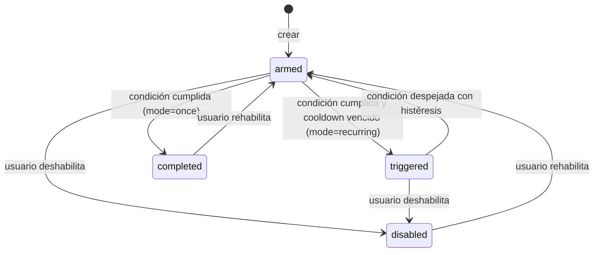

# Etapa 5 — Alertas de precio, outbox de notificaciones y email

> Aplica `00-indice-y-convenciones.md`. Requiere las etapas 0 a 4.

## 1. Objetivo

Permitir que un usuario defina alertas sobre una moneda ("avisame si BTC baja de 50.000") y que el worker, después de cada actualización de precios, las evalúe y envíe un email **una sola vez por disparo**, sin perder notificaciones si el envío falla y sin mandar el mismo mail en cada corrida.

Es la etapa central del proyecto en cuanto a jobs: aparecen el patrón outbox, las transacciones, el *claim* atómico de trabajo, los reintentos con backoff y la entrega *at-least-once*.

## 2. Contexto

- El worker actualiza precios y `latest` cada 10 minutos.
- Los usuarios están autenticados con email sincronizado desde Firebase.
- Existe la watchlist.
- No se envía ningún email todavía.

## 3. Conceptos nuevos de la etapa

- **Máquina de estados:** la alerta pasa por estados definidos (`armed` → `triggered` → `armed`...) y solo transiciones permitidas. Hace que el comportamiento sea predecible y testeable.
- **Histéresis:** margen para "rearmar" una alerta. Si el umbral es 50.000 y el precio oscila entre 49.990 y 50.010, sin margen la alerta se dispararía y se rearmaría en cada corrida. Con un margen del 1 %, solo se rearma cuando el precio vuelve a pasar 50.500.
- **Cooldown:** tiempo mínimo entre dos disparos de la misma alerta, aunque se haya rearmado.
- **Patrón outbox:** en vez de mandar el email en el mismo momento en que detectás la condición, **guardás** una notificación pendiente en la base, en la misma operación que marca la alerta como disparada. Otro paso lee las pendientes y las envía. Si el envío falla, la notificación sigue ahí para reintentarse. Si el proceso muere, no se pierde nada.
- **Transacción:** grupo de escrituras que se aplican todas o ninguna. En Mongo requiere un *replica set* (Atlas lo es; en local hay que configurarlo).
- **Control de concurrencia optimista:** cada alerta tiene un número `version`. Una actualización solo se aplica si la versión sigue siendo la que leíste. Si el usuario editó la alerta mientras el job la evaluaba, la escritura del job no matchea y se descarta.
- **Claim atómico:** un worker "reserva" una notificación con un `findOneAndUpdate` que cambia su estado de `pending` a `sending` en una sola operación. Si dos workers lo intentan a la vez, solo uno gana.
- **Entrega at-least-once:** se garantiza que cada notificación se envíe **al menos** una vez. En un caso raro (el proceso muere justo después de enviar y antes de marcar `sent`) puede llegar dos veces. *Exactly-once* en sistemas distribuidos es muy difícil; lo habitual es at-least-once más deduplicación donde se pueda.
- **Error transitorio vs permanente:** un SMTP caído es transitorio (se reintenta). Un destinatario rechazado con código 5xx es permanente (no tiene sentido reintentar).
- **Dedupe key:** clave única que identifica un evento. Si se intenta crear dos veces, el índice único lo impide.

## 4. Alcance

**Incluye**
- Modelos `Alert` y `Notification`.
- CRUD de alertas del usuario e historial de notificaciones.
- Evaluación de alertas dentro del job `poll-prices`.
- Nuevo job `send-notifications`.
- Mailer (Nodemailer + SMTP) y templates de email.
- Endpoints de admin para notificaciones.
- Mongo en replica set (local y tests).
- Cascada en `DELETE /me`.

**No incluye**
- Otros canales (push, Telegram, webhooks). El modelo deja preparado el campo `channel`.
- Link de "desuscribirse" con un clic (no hay frontend).
- Digest o agrupación de varias alertas en un mail.

## 5. Decisiones técnicas

- Destinatario: siempre el `email` de la cuenta, y solo si `emailVerified: true` (decisión de la etapa 3).
- Se usa `session.withTransaction()` del driver, a través de Mongoose, para "disparar alerta + crear notificación".
- Envío: Nodemailer 10 vía SMTP.
  - Desarrollo: **Mailpit** en Docker. Captura todos los mails y los muestra en una interfaz web local.
  - Producción: un proveedor SMTP a elegir (ver preguntas abiertas).
- Los montos se formatean con `Intl.NumberFormat('es-AR', { style: 'currency', currency: 'USD' })`. Las fechas del email van en UTC, más la zona `America/Argentina/Buenos_Aires` como referencia (configurable con `MAIL_DISPLAY_TIMEZONE`).

## 6. Modelo de datos

### 6.1 `alerts`

| Campo | Tipo | Reglas |
| --- | --- | --- |
| `_id` | ObjectId | Se expone como `id` |
| `userId` | ObjectId | Obligatorio |
| `coinId` | ObjectId | Obligatorio |
| `type` | enum `PRICE_ABOVE` \| `PRICE_BELOW` \| `CHANGE_24H_ABS_GTE` | Inmutable |
| `threshold` | number | Precio: > 0 y ≤ 1e9. Variación: 0.1–100 (puntos porcentuales). |
| `mode` | enum `once` \| `recurring` | Default `recurring` |
| `status` | enum `armed` \| `triggered` \| `completed` \| `disabled` | Default `armed` |
| `cooldownMinutes` | int | Default 60. Rango 5–10080. |
| `rearmPct` | number | Default 1. Rango 0–20. |
| `note` | string \| null | Máximo 200 caracteres |
| `version` | int | Default 0. Se incrementa en **cada** modificación. |
| `triggerCount` | int | Default 0 |
| `lastTriggeredAt` | Date \| null | — |
| `lastTriggeredValue` | number \| null | Precio o variación al momento del disparo |
| `lastEvaluatedAt` | Date \| null | — |
| `createdAt` / `updatedAt` | Date | — |

Índices:
- `{ coinId: 1, status: 1 }`: lo usa la evaluación.
- `{ userId: 1, createdAt: -1 }`.
- `{ userId: 1, status: 1 }`.

**Límite:** `ALERTS_MAX_ACTIVE` por usuario (default 20). Cuenta las alertas en `armed` o `triggered`.

### 6.2 Máquina de estados de la alerta



**Condición de disparo** (`v` = valor actual):
- `PRICE_ABOVE`: `v.priceUsd >= threshold`
- `PRICE_BELOW`: `v.priceUsd <= threshold`
- `CHANGE_24H_ABS_GTE`: `|v.change24hPct| >= threshold`. Si `change24hPct` es `null`, no se evalúa.

**Condición de rearme** (solo desde `triggered`):
- `PRICE_ABOVE`: `v.priceUsd < threshold × (1 − rearmPct/100)`
- `PRICE_BELOW`: `v.priceUsd > threshold × (1 + rearmPct/100)`
- `CHANGE_24H_ABS_GTE`: `|v.change24hPct| < max(0, threshold − rearmPct)`

**Cooldown:** una alerta `armed` con la condición cumplida solo se dispara si `lastTriggeredAt` es `null` o si `now − lastTriggeredAt ≥ cooldownMinutes`. Si todavía está en cooldown, queda `armed` y se vuelve a evaluar en la próxima corrida.

### 6.3 `notifications`

| Campo | Tipo | Reglas |
| --- | --- | --- |
| `_id` | ObjectId | Se expone como `id` |
| `userId` | ObjectId | — |
| `alertId` | ObjectId | — |
| `channel` | enum `email` | — |
| `to` | string | Email del usuario **al momento del disparo** |
| `status` | enum `pending` \| `sending` \| `sent` \| `failed` \| `cancelled` | — |
| `dedupeKey` | string | **Único**: `${alertId}:${triggerCount}` |
| `payload` | object | Datos para renderizar: `coingeckoId`, `coinName`, `symbol`, `alertType`, `threshold`, `value`, `priceUsd`, `change24hPct`, `triggeredAt`, `note` |
| `attempts` | int | Default 0 |
| `maxAttempts` | int | Default `NOTIFY_MAX_ATTEMPTS` (5) |
| `nextAttemptAt` | Date | Al crear, `now` |
| `lockedAt` / `lockedBy` | Date \| null / string \| null | — |
| `lastError` | `{ code, message, permanent }` \| null | — |
| `sentAt` | Date \| null | — |
| `providerMessageId` | string \| null | — |
| `createdAt` / `updatedAt` | Date | — |

Índices:
- `{ dedupeKey: 1 }` único.
- `{ status: 1, nextAttemptAt: 1 }`: lo usa el claim.
- `{ status: 1, lockedAt: 1 }`: lo usa la recuperación de envíos colgados.
- `{ userId: 1, createdAt: -1 }`.
- `{ alertId: 1, status: 1 }`.
- TTL sobre `createdAt` con `NOTIFICATIONS_RETENTION_DAYS` (default 90).

**Por qué guardar `payload` y `to`:** la notificación es una foto del evento. Si el usuario edita la alerta o la moneda cambia de precio antes del envío, el mail tiene que contar lo que pasó en el momento del disparo.

## 7. Requerimientos funcionales

### RF-5.1 Mongo en replica set
- `docker-compose.yml`: el servicio `mongo` corre con `--replSet rs0 --bind_ip_all`, con un healthcheck que ejecuta `rs.initiate()` si todavía no está iniciado.
- URI local: `mongodb://localhost:27017/?replicaSet=rs0&directConnection=true`.
- Tests: `MongoMemoryReplSet` con 1 nodo.
- Al arrancar, la API y el worker verifican que la conexión soporte transacciones (el comando `hello` debe devolver `setName`). Si no, salen con código 1 y un mensaje claro.

### RF-5.2 Endpoints de alertas del usuario
Todos con `requireAuth`. Siempre se filtra por `userId` (regla de aislamiento de la etapa 4).

**`GET /api/v1/me/alerts`**
- Query: `status` (uno o varios separados por coma), `coingeckoId`, `page`, `limit`.
- Lista paginada, ordenada por `createdAt` descendente.
- Cada ítem incluye la moneda (`coingeckoId`, `symbol`, `name`, `isActive`) y `latest.priceUsd` y `latest.change24hPct`.

**`POST /api/v1/me/alerts`**
- Body (Zod `strict`): `{ coingeckoId, type, threshold, mode?, cooldownMinutes?, rearmPct?, note? }`. El rango válido de `threshold` depende de `type` (se valida con un `discriminatedUnion` de Zod o con `superRefine`).
- Validaciones, en orden:
  1. Body inválido → 400.
  2. Usuario sin email o con `emailVerified: false` → 422 con `reason: EMAIL_NOT_VERIFIED`.
  3. Moneda inexistente o inactiva → 404.
  4. Límite de activas alcanzado → 422 con `reason: LIMIT_REACHED`.
- Se crea en `armed` y **no** se evalúa en el momento: se evalúa en la próxima corrida del job.
- 201:
```json
{
  "data": {
    "id": "66f0...",
    "coin": { "coingeckoId": "bitcoin", "symbol": "btc", "name": "Bitcoin", "isActive": true },
    "type": "PRICE_BELOW",
    "threshold": 50000,
    "mode": "recurring",
    "status": "armed",
    "cooldownMinutes": 60,
    "rearmPct": 1,
    "note": null,
    "triggerCount": 0,
    "lastTriggeredAt": null,
    "createdAt": "..."
  },
  "meta": { "currentValue": 64210.12, "conditionCurrentlyMet": false }
}
```
- `meta.conditionCurrentlyMet` avisa que, si ya se cumple, la alerta va a dispararse en la próxima corrida.

**`GET /api/v1/me/alerts/:id`**
- `id` con formato inválido → 400.
- Inexistente **o de otro usuario** → 404. Se responde 404 y no 403 para no revelar que el recurso existe.

**`PATCH /api/v1/me/alerts/:id`**
- Body: `{ threshold?, cooldownMinutes?, rearmPct?, note?, mode?, enabled? }`, con al menos un campo.
- Si viene `type`, responde 400 (es inmutable).
- Reglas:
  - `enabled: false` → `status: disabled`.
  - `enabled: true` desde `disabled` o `completed` → `status: armed`. Rehabilitar cuenta para el límite de activas: si se supera, 422.
  - Un cambio de `threshold` sobre una alerta `triggered` la pasa a `armed`. No se resetean `lastTriggeredAt` ni `triggerCount`.
  - Cada modificación hace `version: +1`. Se implementa con `updateOne({ _id, userId }, { $set: ..., $inc: { version: 1 } })`.
- 200 con la alerta.

**`DELETE /api/v1/me/alerts/:id`**
- Borra la alerta y pasa a `cancelled` sus notificaciones en `pending`. Las que están en `sending` se dejan terminar.
- Responde 204 siempre, aunque no exista o sea de otro usuario (en ese caso no borra nada).

**`GET /api/v1/me/notifications`**
- Query: `status`, `page`, `limit`.
- Devuelve `id`, `alertId`, `status`, `payload`, `attempts`, `sentAt`, `createdAt` y `to` enmascarado.
- No expone `lockedBy`, `dedupeKey` ni el detalle técnico de `lastError`: si falló, solo `lastError.code`.

### RF-5.3 Evaluación de alertas dentro de `poll-prices`
Nuevo paso al final del job, después de actualizar `latest`:

1. **Entrada:** el mapa `coinId → valores nuevos` de **esta** corrida (solo las monedas que tuvieron snapshot nuevo).
2. Recorre con cursor (`.cursor()`, no todo en memoria) las alertas con `coinId ∈ entrada` y `status ∈ { armed, triggered }`.
3. Para cada alerta, calcula la decisión con una **función pura** `decide(alert, value, now)`, que devuelve `TRIGGER`, `REARM`, `COOLDOWN` o `NOOP`.
4. **`TRIGGER`**, dentro de `session.withTransaction()`:
   - `updateOne({ _id, version: alert.version, status: 'armed' }, { $set: { status: mode === 'once' ? 'completed' : 'triggered', lastTriggeredAt: now, lastTriggeredValue, lastEvaluatedAt: now }, $inc: { version: 1, triggerCount: 1 } })`.
   - Si `matchedCount === 0` (la alerta cambió en el medio), aborta la transacción, suma a `triggerConflicts` y sigue con la próxima.
   - Carga el usuario. Si ya no existe o no tiene email verificado, aborta y loguea en `warn`.
   - Inserta la `Notification` en `pending` con `dedupeKey = ${alertId}:${triggerCount + 1}`.
   - Un `E11000` en `dedupeKey` significa que la notificación ya existe: se trata como éxito idempotente.
5. **`REARM`:** `updateOne({ _id, version, status: 'triggered' }, { $set: { status: 'armed', lastEvaluatedAt: now }, $inc: { version: 1 } })`, sin transacción.
6. **`COOLDOWN` / `NOOP`:** no escribe nada. `lastEvaluatedAt` **no** se actualiza en estos casos, para no escribir por cada alerta en cada corrida. Se documenta que `lastEvaluatedAt` refleja el último cambio de estado.
7. Nuevos `stats` en `JobRun`: `alertsEvaluated`, `alertsTriggered`, `alertsRearmed`, `alertsInCooldown` y `triggerConflicts`.
8. Si la evaluación falla por completo (por ejemplo, se cae la base), el run queda `partial` con `error.code: ALERT_EVALUATION_FAILED`. Los precios ya guardados no se ven afectados. Las alertas se evalúan en la corrida siguiente con los valores nuevos.
9. Al terminar, si hubo al menos un `TRIGGER`, dispara `send-notifications` enseguida (RF-5.5), respetando su guard de overlap, para que el mail no espere al próximo minuto.

### RF-5.4 Mailer
```ts
interface Mailer {
  send(msg: { to: string; subject: string; text: string; html: string }): Promise<{ messageId: string }>;
  verify(): Promise<void>;
}
```
- `SmtpMailer`: `nodemailer.createTransport({ host, port, secure: port === 465, auth })`, con timeouts de conexión y socket de 10 s.
- Traducción de errores:
  - Si el error trae `responseCode` entre 500 y 599 → `MailError` con `permanent: true` y `code: SMTP_REJECTED`.
  - Errores de conexión, timeout o 4xx → `permanent: false` y `code: SMTP_UNAVAILABLE`.
- `FakeMailer` (tests): guarda los mensajes en memoria y se puede configurar para fallar con un error transitorio o permanente.
- Al arrancar el worker, `mailer.verify()`. Si falla, loguea en `error` y **no** detiene el worker: las notificaciones quedan `pending` y se reintentan.

### RF-5.5 Job `send-notifications`
- Programado con `SEND_NOTIFICATIONS_CRON` (default `* * * * *`, cada minuto). Tiene su propio guard de overlap y registra su propio `JobRun` (`jobName: send-notifications`).
- Pasos:
  1. **Recuperación de envíos colgados:** las notificaciones en `sending` con `lockedAt < now − NOTIFY_LOCK_TIMEOUT_MIN` (default 10) vuelven a `pending`, con `attempts + 1` y `nextAttemptAt = now`. Suma a `stats.recoveredStale`. Si con ese incremento llegan a `maxAttempts`, pasan a `failed`.
  2. **Claim en bucle,** hasta `NOTIFY_BATCH_SIZE` (default 20) notificaciones:
     `findOneAndUpdate({ status: 'pending', nextAttemptAt: { $lte: now } }, { $set: { status: 'sending', lockedAt: now, lockedBy: workerId } }, { sort: { nextAttemptAt: 1 }, new: true })`.
     Si devuelve `null`, se termina el bucle.
  3. **Por cada notificación reservada:**
     1. Verifica que el usuario exista. Si no, la pasa a `cancelled`.
     2. Renderiza el template con `payload` (RF-5.6).
     3. `mailer.send()`.
     4. Si el envío funciona: `status: sent`, `sentAt`, `providerMessageId` y el lock limpio.
     5. Si falla con error permanente: `status: failed` y `lastError`.
     6. Si falla con error transitorio: `attempts + 1`. Si `attempts >= maxAttempts`, pasa a `failed`. Si no, vuelve a `pending` con `nextAttemptAt = now + backoff[attempts - 1]`, donde `backoff = [1, 5, 15, 60]` minutos con jitter de ±10 %.
     7. **Todas** las actualizaciones posteriores al envío llevan el filtro `{ _id, status: 'sending', lockedBy: workerId }`, para no pisar una notificación que otro proceso ya recuperó.
  4. Los envíos del lote se hacen **en secuencia**, respetando `MAIL_MAX_PER_MINUTE` (default 30). Si se alcanza el tope, se corta el lote y lo que falta queda para el minuto siguiente.
  5. `stats`: `claimed`, `sent`, `retried`, `failedPermanent`, `failedExhausted`, `cancelled` y `recoveredStale`.
- Los logs nunca incluyen el email completo del destinatario.

### RF-5.6 Template de email
- Módulo `src/modules/notifications/templates/alert-triggered.ts`, con una función pura `render(payload) → { subject, text, html }`.
- **Asunto:**
  - `[Crypto Tracker] BTC por debajo de US$ 50.000,00`
  - `[Crypto Tracker] BTC por encima de ...`
  - `[Crypto Tracker] BTC se movió 7,5 % en 24 h`
- **Cuerpo** (texto y HTML con la misma información):
  - Moneda (nombre y símbolo).
  - Condición configurada y umbral.
  - Valor que la disparó.
  - Variación de 24 h.
  - Fecha y hora del disparo (UTC y hora local de referencia).
  - Nota del usuario, si existe.
  - Cómo desactivar la alerta: `PATCH /api/v1/me/alerts/<id>` con `{ "enabled": false }`.
- Todo dato que venga del usuario o de terceros (`note`, `coinName`) se **escapa** en el HTML (`&`, `<`, `>`, `"`, `'`). El asunto no puede contener saltos de línea: se eliminan `\r` y `\n` para evitar inyección de headers.
- HTML simple, con estilos inline y sin imágenes externas ni píxeles de tracking.

### RF-5.7 Endpoints de admin
Con `requireAuth({ checkRevoked: true })` + `requireRole('admin')`.

- **`GET /api/v1/admin/notifications`**
  - Filtros: `status`, `userId`, `from`, `to`, más paginación.
  - Incluye `lastError` completo y `lockedBy`.
- **`POST /api/v1/admin/notifications/:id/retry`**
  - Solo si está en `failed`: pasa a `pending` con `attempts: 0`, `nextAttemptAt: now` y `lastError: null`.
  - En cualquier otro estado, 409.
- **`POST /api/v1/admin/notifications/test-email`**
  - Envía **en el momento** (sin outbox) un mail de prueba al email del admin autenticado.
  - 200 con `messageId`. Si el SMTP falla, 502 con el código del error.
  - Sirve para validar la configuración SMTP en cada entorno.

### RF-5.8 Cascada en `DELETE /me`
Orden:
1. Las notificaciones `pending` del usuario pasan a `cancelled`.
2. Se borran las alertas.
3. Se borra la watchlist (etapa 4).
4. Se borra el usuario.

El historial de notificaciones del usuario se borra también (`deleteMany`), salvo las que estén en `sending`: esas se dejan terminar y después las limpia el TTL.

## 8. Requerimientos no funcionales

- **RNF-5.1:** con 1.000 alertas activas sobre 10 monedas, la evaluación completa tarda menos de 2 s en local cuando no hay disparos.
- **RNF-5.2:** ningún disparo genera más de una notificación, aunque dos corridas se superpongan (garantizado por `version`, transacción y `dedupeKey`).
- **RNF-5.3:** ninguna notificación queda en `sending` más de `NOTIFY_LOCK_TIMEOUT_MIN` + 1 minuto sin ser recuperada, mientras haya un worker vivo.
- **RNF-5.4:** los mails no contienen datos de otros usuarios ni información interna (IDs de Mongo, salvo el `id` de la alerta necesario para desactivarla).
- **RNF-5.5:** credenciales SMTP solo en variables de entorno.
- **RNF-5.6:** una caída del SMTP no afecta la actualización de precios ni la evaluación de alertas.

## 9. Variables de entorno nuevas

| Variable | Default | Uso |
| --- | --- | --- |
| `SMTP_HOST` | — (obligatoria en el worker) | Local: `localhost` (Mailpit) |
| `SMTP_PORT` | 587 | Local: 1025 |
| `SMTP_USER` / `SMTP_PASS` | — | Opcionales en local. **Secretos.** |
| `MAIL_FROM` | — | Por ejemplo `Crypto Tracker <alerts@tu-dominio>` |
| `MAIL_DISPLAY_TIMEZONE` | `America/Argentina/Buenos_Aires` | — |
| `MAIL_MAX_PER_MINUTE` | 30 | — |
| `ALERTS_MAX_ACTIVE` | 20 | — |
| `SEND_NOTIFICATIONS_CRON` | `* * * * *` | — |
| `NOTIFY_BATCH_SIZE` | 20 | — |
| `NOTIFY_MAX_ATTEMPTS` | 5 | — |
| `NOTIFY_LOCK_TIMEOUT_MIN` | 10 | — |
| `NOTIFICATIONS_RETENTION_DAYS` | 90 | — |

Servicio agregado a `docker-compose.yml`: `mailpit` (imagen `axllent/mailpit`), con SMTP en 1025 y UI en 8025.

## 10. Casos borde

- **El usuario edita la alerta mientras el job la evalúa:** el `version` no coincide, no se dispara y se registra un conflicto. En la próxima corrida se evalúa con los datos nuevos.
- **Dos workers evalúan a la vez** (o el worker y un `job:poll-prices` manual): el conditional update deja pasar solo a uno y el otro registra un conflicto.
- **El precio cruza el umbral y vuelve dentro de la misma ventana de 10 minutos:** no se detecta. Es una limitación del muestreo y se documenta.
- **El usuario pierde el email verificado después de crear la alerta:** en el disparo no se crea la notificación (se loguea en `warn`) y la alerta queda `armed` para la próxima corrida. Opcional: pasarla a `disabled`.
- **Alerta de una moneda desactivada:** no se evalúa (no hay valores nuevos) y se muestra con `coin.isActive: false`.
- **El SMTP acepta el mail pero el proceso muere antes de marcar `sent`:** la notificación se recupera como colgada y se reenvía. Puede llegar dos veces (at-least-once, documentado).
- **Proveedor SMTP con rate limit (respuesta 421/451):** es un error transitorio, así que entra en backoff.
- **`CHANGE_24H_ABS_GTE` con `change24hPct: null`:** `NOOP`.
- **`threshold` con muchos decimales:** se acepta y se muestra con el formato de moneda (2 decimales). Para monedas de precio muy bajo, se usan hasta 8 decimales si el valor es menor que 1.

## 11. Criterios de aceptación

- **E5-1:** DADO un usuario con email no verificado, CUANDO crea una alerta, ENTONCES recibe 422 con `reason: EMAIL_NOT_VERIFIED`.
- **E5-2:** DADA una alerta `PRICE_BELOW 50000` en `armed` y un precio nuevo de 49.000, CUANDO corre el job, ENTONCES la alerta pasa a `triggered`, `triggerCount` vale 1 y existe una notificación `pending` con `dedupeKey` `<id>:1`.
- **E5-3:** DADA esa alerta en `triggered` y un precio de 49.500 en la corrida siguiente, ENTONCES no se crea otra notificación y la alerta sigue `triggered`.
- **E5-4:** DADA esa alerta con `rearmPct: 1` y un precio de 50.400, ENTONCES sigue `triggered`. Con 50.600, pasa a `armed`.
- **E5-5:** DADA una alerta rearmada con `lastTriggeredAt` de hace 20 minutos, `cooldownMinutes: 60` y el precio otra vez en 49.000, ENTONCES **no** se dispara (cooldown). A los 61 minutos, sí.
- **E5-6:** DADA una alerta con `mode: once`, CUANDO se dispara, ENTONCES pasa a `completed` y no vuelve a evaluarse hasta que el usuario la rehabilite.
- **E5-7:** DADA una alerta cuya `version` cambió entre la lectura y la escritura, ENTONCES no se dispara, no se crea notificación y `triggerConflicts` vale 1.
- **E5-8:** DADO que la inserción de la notificación falla dentro de la transacción, ENTONCES la alerta sigue en `armed` (rollback).
- **E5-9:** DADA una notificación `pending`, CUANDO corre `send-notifications` con `FakeMailer` funcionando, ENTONCES queda `sent` con `providerMessageId` y el `FakeMailer` tiene un mensaje con el asunto esperado.
- **E5-10:** DADO un error SMTP transitorio, ENTONCES queda `pending`, con `attempts: 1` y `nextAttemptAt` a aproximadamente 1 minuto. Después de 5 fallos, queda `failed`.
- **E5-11:** DADO un error SMTP 550, ENTONCES queda `failed` en el primer intento, con `lastError.permanent: true`.
- **E5-12:** DADOS dos procesos `send-notifications` concurrentes y 10 notificaciones `pending`, ENTONCES cada notificación se envía exactamente una vez.
- **E5-13:** DADA una notificación en `sending` con `lockedAt` de hace 15 minutos, CUANDO corre `send-notifications`, ENTONCES vuelve a `pending` y se envía en ese mismo run.
- **E5-14:** DADA una nota `<b>hola</b>`, ENTONCES el HTML del mail contiene `&lt;b&gt;hola&lt;/b&gt;`.
- **E5-15:** DADO un usuario con 2 alertas y 1 notificación pendiente, CUANDO hace `DELETE /me`, ENTONCES no quedan alertas y la notificación queda `cancelled` o borrada, y nunca se envía.
- **E5-16:** DADO un usuario B, CUANDO pide `GET /me/alerts/<id de A>`, ENTONCES recibe 404.
- **E5-17:** DADO un admin, CUANDO reintenta una notificación `failed`, ENTONCES pasa a `pending` con `attempts: 0`. Si estaba `sent`, recibe 409.
- **E5-18 (manual):** con Mailpit levantado, crear una alerta que se cumpla, correr `job:poll-prices` y ver el mail en `http://localhost:8025` en menos de 1 minuto.

## 12. Testing requerido

**Unitarios**
- `decide(alert, value, now)` con una tabla de casos: los 3 tipos × disparo, rearme, cooldown, `null` y bordes exactos (`==` umbral).
- Cálculo de backoff con jitter acotado.
- Clasificación de errores SMTP (transitorio o permanente) según `responseCode` y códigos de red.
- `render(payload)`: asunto por tipo, formato de números en `es-AR`, escape de HTML, eliminación de saltos de línea en el asunto.
- Validación del body de alertas por tipo (rangos de `threshold`).

**Integración** (`MongoMemoryReplSet` + `FakeMailer` + `FakeTokenVerifier`)
- E5-1 a E5-17.
- E5-7: modificar `version` desde el test entre `find` y `decide` (inyectar un hook en el repositorio) o llamar al paso de disparo con una alerta desactualizada.
- E5-8: repositorio de notificaciones que lanza error en `insert`, para verificar el rollback.
- E5-12: dos instancias del job con `workerId` distinto, ejecutadas con `Promise.all`, y verificación de que el `FakeMailer` recibió exactamente 10 mensajes con destinatarios únicos por notificación.
- Verificación al arrancar de que la conexión es replica set (RF-5.1).

**Manual:** E5-18.

## 13. Preguntas abiertas

- **Proveedor SMTP de producción** (Brevo, Resend, Amazon SES, Mailgun...) y **dominio propio**. Sin un dominio con SPF y DKIM configurados, muchos proveedores limitan el envío o los mails caen en spam. Define `MAIL_FROM`.
- ¿Una alerta cuyo usuario perdió el email verificado debe pasar a `disabled` automáticamente? Por defecto, queda `armed`.
